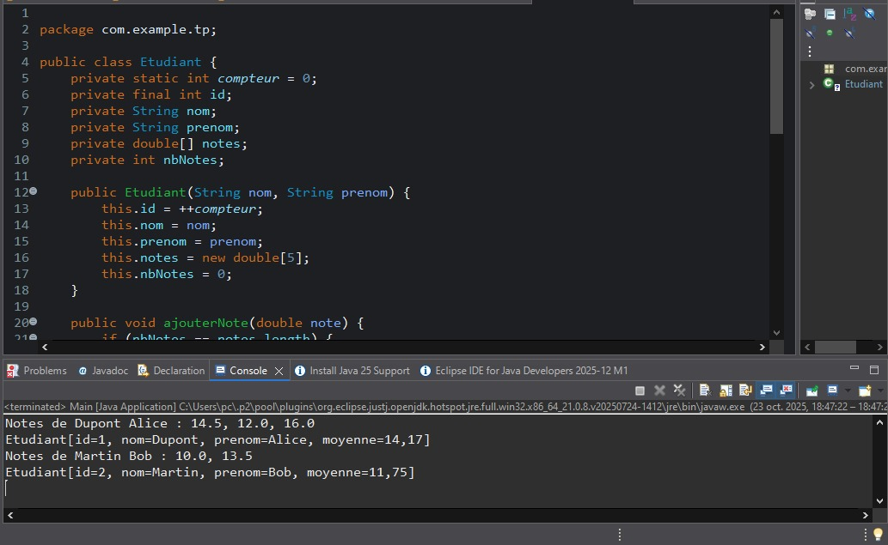
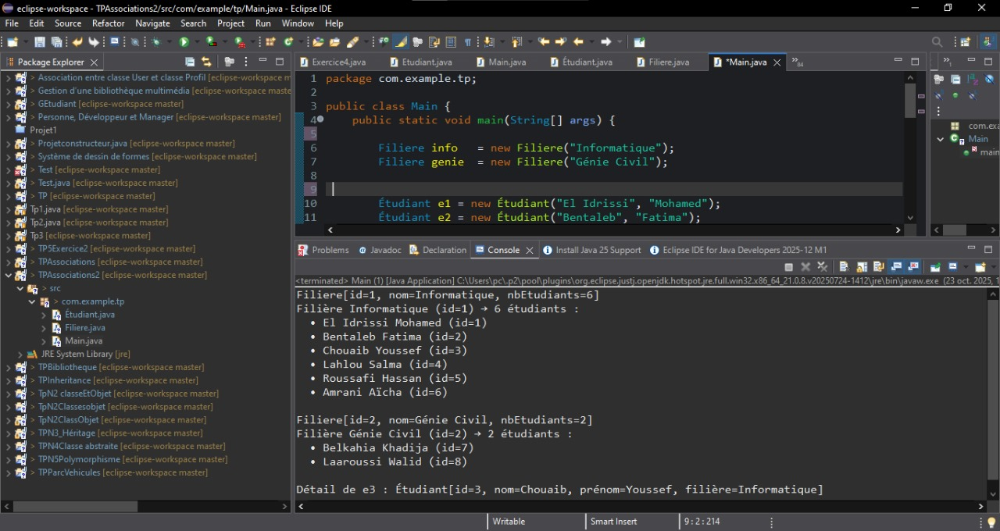
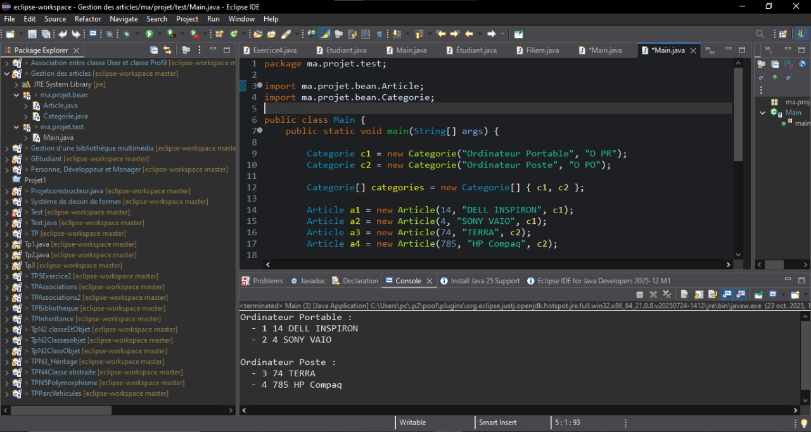
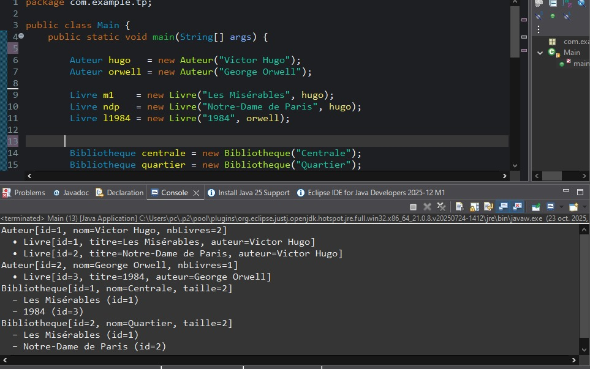

# TP4 — Classes & Objets (Java)

##   Objectif global
- Comprendre et pratiquer : **classes**, **attributs**, **méthodes**, `toString()`.
- S’exercer aux **tableaux (fixes et dynamiques)** et aux **associations** entre objets.
- Utiliser des **identifiants auto-incrémentés** (`static int compteur`).

## Prérequis
JDK 8 ou ultérieur installé

IDE ou éditeur de texte configuré

Notions de base : classes, tableaux, boucles, méthodes

# Exercice 1 : Gestion d’un étudiant avec tableau de notes
Définition / But

Modéliser un étudiant qui gère ses notes dans un tableau extensible (capacité qui double automatiquement).

Savoir ajouter des notes, calculer une moyenne et afficher proprement.

structure:
```bash
TPAssociations/
└─ src/
   └─ com/example/tp/
      ├ Etudiant.java
      └ Main.java

```
Contenu :

Etudiant.java : contient la classe Etudiant (tableau dynamique de notes).

Main.java : programme principal pour tester la classe Etudiant.

 Résultat visuel
<div align="center">  <p><em>Figure 1 — </em></p> </div>

#  Exercice 2 : Association Étudiant ↔ Filière (avec tableaux)
Définition / But

Implémenter une association 1→N : une Filiere regroupe plusieurs Étudiant.

Gérer la collection d’étudiants avec un tableau extensible (sans List).

structure:
```bash
TPAssociations2/
└─ src/
   └─ com/example/tp/
      ├ Etudiant.java
      ├ Filiere.java
      └ Main.java
```
Contenu :

Etudiant.java : classe Étudiant (associée à une filière).

Filiere.java : classe Filière (regroupe plusieurs étudiants).

Main.java : programme principal pour tester l’association Étudiant ↔ Filière.

Résultat visuel
<div align="center">  <p><em>Figure 2 — </em></p> </div>

#   Exercice 3 : Gestion des articles
Définition / But

Créer deux classes métier (Categorie, Article) et afficher les articles par catégorie avec uniquement des tableaux et des boucles.

```bash
Gestion des articles/
└─ src/
   ├─ ma/projet/bean/
   │  ├ Article.java
   │  └ Categorie.java
   └─ ma/projet/test/
      └ Main.java
```
Contenu :

Article.java : classe Article (code, désignation, catégorie).

Categorie.java : classe Catégorie (libellé et code).

Main.java : programme de test affichant les articles par catégorie.

Résultat visuel
<div align="center">  <p><em>Figure 3 — </em></p> </div>

#   Exercice 4 ** : Gestion d’Auteurs, Livres et Bibliothèques
Définition / But

Modéliser deux associations :
1→N (un Auteur écrit plusieurs Livre) et N↔N (une Bibliotheque contient plusieurs Livre, un Livre peut être dans plusieurs bibliothèques).

Renforcer la cohérence des liens et l’usage d’id auto-incrémentés.

```bash
TPAssociations3/
└─ src/
   └─ com/example/tp/
      ├ Auteur.java
      ├ Livre.java
      ├ Bibliotheque.java
      └ Main.java

```
Contenu :

Auteur.java : classe Auteur (nom + liste de livres).

Livre.java : classe Livre (titre + lien vers un auteur).

Bibliotheque.java : classe Bibliothèque (ensemble de livres).

Main.java : programme principal pour tester les associations Auteur ↔ Livre ↔ Bibliothèque.

Résultat visuel
<div align="center">  <p><em>Figure 4 — </em></p> </div>


